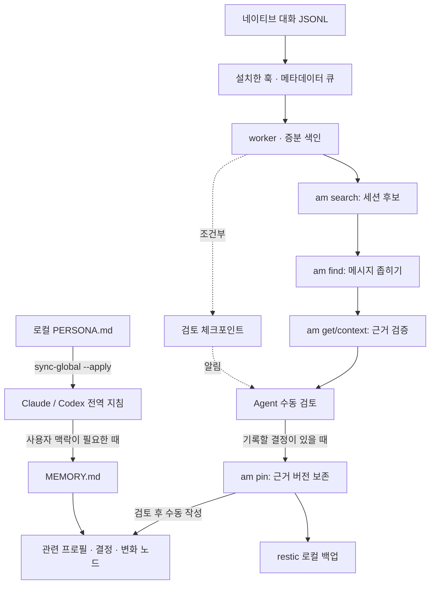

# PersonaGraph

[English](README.md) | **한국어**

Claude Code와 Codex를 위한 로컬 CLI 기반 사용자 정렬 메모리.

사용자가 확인한 선택과 근거를 작은 Markdown 그래프로 보존합니다. aichat-search로 대화 세션을 찾고, 원문 메시지를 검증한 뒤 인용한 버전을 암호화된 로컬 백업으로 보존합니다. 자동 수집은 검토 체크포인트를 생성하며, 정렬 지침을 직접 작성하지 않습니다.

**초기 알파 · POSIX 환경 지원.** macOS에서 개발했으며 macOS·Linux CI 결과는 Actions에서 확인할 수 있습니다. Windows 지원, 대규모 기록에서의 전체 성능 검증, Codex의 자동 80% 사용량 관측, 장기적인 사용자 정렬 효과는 현재 릴리스의 검증 범위에 포함되지 않습니다.

## 동작 흐름

[브라우저에서 흐름 시각화 보기](https://fmsongx2.github.io/personagraph/) · [시각화 원본과 검증 정보](docs/diagrams/README.md)

Archify로 만든 두 그림에서 **시작 시 맥락 읽기**와 **수집 → 검색 → 근거 확인 → 수동 갱신**을 따로 볼 수 있습니다. 그림의 설명은 한국어이며, 뷰어의 기본 버튼과 메뉴는 영어입니다. HTML은 내려받아 로컬 브라우저에서도 열 수 있습니다.



페르소나·사용자 정렬, 프로젝트의 진행 기억, 도메인 지식은 역할이 다릅니다. 이 저장소는 페르소나·정렬 노트와 대화 근거 어댑터를 제공합니다. 기존 프로젝트 메모리나 지식 도구는 노트에서 연결할 수 있으며, 자동 설치하거나 사용자 취향으로 취급하지 않습니다.

## 빠른 시작

필요한 도구: Python 3.11+, [uv](https://docs.astral.sh/uv/), Cargo/Rust, Git, [restic](https://restic.net/). 메모리 CLI 자체에는 API 키가 필요하지 않습니다. Claude/Codex 클라이언트의 인증은 각 클라이언트에서 관리합니다.

```sh
git clone https://github.com/FMsongX2/personagraph.git
cd personagraph
python3 scripts/init-memory.py                 # 가상 예제로 로컬 비공개 memory/ 생성
python3 scripts/install-aichat-search.py        # 고정한 업스트림과 색인 환경 설치
./am --help
```

한국어 여동생 역할의 엔지니어 페르소나를 선택하려면 초기화 명령을 `python3 scripts/init-memory.py --persona yui`로 실행합니다. 프로필은 로컬에서 직접 수정합니다. 예제의 이름·결정·페르소나는 가상 예제이며, 관리자의 실제 프로필이나 대화는 포함하지 않습니다.

전역 페르소나와 메모리 라우팅이 필요하면 먼저 미리 봅니다.

```sh
python3 scripts/sync-global.py
python3 scripts/sync-global.py --apply          # 백업 후 Claude/Codex 전역 지침에 반영
python3 scripts/sync-global.py --check
```

처음 적용할 때는 기존 전역 지침을 로컬에 백업하고 교체합니다. 이후에는 예상하지 못한 수동 변경이 있으면 적용을 거부합니다. 전역 지침 동기화는 선택 사항이며, 수집 훅 설치와 별개입니다.

## 근거 CLI

```sh
./am index /absolute/path/to/native-session.jsonl --adapter codex
./am index /absolute/path/to/native-session.jsonl --adapter claude
./am search 'keyword' --limit 5
./am find 'literal phrase' --source '<source-key>' --limit 8
./am get --source '<source-key>' --id '<message-id>' --hash '<sha256>'
./am context --source '<source-key>' --id '<message-id>' --before 2
./am pin --source '<source-key>' --id '<message-id>' --hash '<sha256>'
```

`search`는 세션 후보와 미완료 갱신 정보를 반환합니다. 후보는 검증된 메시지 근거가 아닙니다. `find`는 한 세션 안에서 원문을 찾으며 기본 2,000개 메시지 탐색 한도와 불완전한 탐색 여부를 보고합니다. `get`은 메시지 ID·역할·내용 해시를 검증합니다. 읽기 명령은 디스크 스키마나 쓰기용 카탈로그 잠금을 생성하지 않습니다. `pin`은 인용할 근거를 저장하고 restic 로컬 백업을 실행합니다. 백업 실패와 근거 저장 결과는 별도로 보고합니다.

## 자동 수집: 선택 설치

```sh
python3 scripts/install-alignment-capture.py                    # 미리보기
python3 scripts/install-alignment-capture.py --apply             # 생명주기 훅 설치
python3 scripts/install-alignment-capture.py --apply --statusline # Claude 문맥 사용량 관측도 설치
```

기존 훅은 유지합니다. Codex의 새 훅은 `/hooks`에서 검토해야 하며, 설치기는 신뢰 해시를 수정하거나 검토를 우회하지 않습니다. 설정을 적용하려면 클라이언트를 시작하거나 재개합니다. 별도 설정 경로는 `--claude-home`, `--codex-home`으로 지정할 수 있습니다.

Claude 상태 표시줄 관측기는 기존 명령 기반 렌더러의 출력을 유지합니다. 기존 렌더러가 없다면 출력하지 않습니다. 다른 도구가 statusLine을 다시 쓰는 환경에서는 수동 통합이 필요할 수 있습니다. Orca 전용 스크립트에는 의존하지 않습니다.

```sh
python3 scripts/alignment-capture.py status
python3 scripts/alignment-capture.py reviews
python3 scripts/alignment-capture.py worker --retry
```

Claude는 실제 문맥 사용률을 관측했을 때 압축 세대별로 한 번 80% 체크포인트를 요청할 수 있습니다. Codex의 지원 입력에는 신뢰할 만한 사용률이 없어 PreCompact를 사용합니다. 문맥 크기나 자동 압축 임계치는 바꾸지 않습니다. 압축 전과 세션 종료에도 검토를 요청할 수 있습니다. 체크포인트는 알림이며, MD 갱신은 검토한 에이전트가 따로 수행합니다.

## 데이터 소유와 복구

| 위치 | 내용 |
|---|---|
| `memory/` | 로컬 비공개 Markdown 정렬 노트 |
| `data/alignment-evidence/` | 인용한 불변 원문 근거 |
| `data/private/` | 백업 키·기존 렌더러·로컬 상태 |
| `data/capture-queue/` | 영속 수집 메타데이터 |
| `data/backups/` | 암호화된 restic 로컬 저장소 |
| `runtime/` | 재생성 가능한 카탈로그·검색 자산·체크포인트·의존성 |

위 로컬 폴더는 모두 Git에서 제외합니다. **data/를 캐시처럼 정리하면 안 됩니다.** 같은 디스크의 백업은 기기 손실을 막지 못합니다. 필요하면 백업 저장소와 비밀번호를 별도로 다른 기기에 보관합니다. 자동 원격 업로드나 백업 가지치기는 제공하지 않습니다.

```sh
./am backup
./am backup-check --read-data
./am restore --snapshot '<explicit-restic-snapshot-id>'
```

복구는 격리된 임시 공간에서 데이터를 검증하고, 불변 파일의 충돌을 거부합니다. 원문 세션이나 재생성 가능한 카탈로그가 없어도 고정한 근거는 source/ID/hash로 읽을 수 있습니다. 고정하지 않은 원문은 노트만으로 복구할 수 없습니다.

## 노트와 검토

[검토 경계](docs/review.md), [아키텍처](docs/architecture.md), [가상 예제](examples/memory/MEMORY.md)를 참고합니다. 이 보조 문서는 영어입니다. 선택 도구인 [zk](https://github.com/zk-org/zk)는 로컬 Markdown을 색인할 수 있습니다. 수정한 zk 바이너리는 배포하지 않습니다. zk 설치 후 다음 명령으로 색인·검색합니다.

```sh
zk -W "$PWD/memory" index
zk -W "$PWD/memory" list --match "keyword" --quiet --no-pager
```

## 검증과 한계

로컬 검사와 macOS·Linux CI는 추가·수정·무변경 색인, 카탈로그와 검색 세대의 일관된 발행, 실패 격리, 중단 후 재시도, 읽기 전용 근거 조회, 체크포인트 경계, 실제 restic 복구 등을 확인합니다. 개발 중에는 짧은 실제 Codex CLI 세션의 수동 압축·재개와 근거 조회도 검증했습니다. 이 결과가 광범위한 프로덕션 신뢰성이나 모델의 사용자 정렬 성능을 입증하지는 않습니다.

접두부 무결성 확인은 이전 바이트를 계속 읽으며, 새 세대를 준비할 때 색인 자산을 복사합니다. 변경한 세션은 문서 하나로 다시 토큰화합니다. 검색은 한국어 형태소 분석이나 의미 검색이 아닙니다. 네이티브 대화 형식은 바뀔 수 있으며, 출처를 확인할 수 없는 항목은 거부하거나 격리합니다. 서브에이전트와 headless exec 세션은 자동 정렬 수집에서 제외합니다. 업스트림 후보 로더에는 세션 100,000개 한도가 있습니다.

자체 코드와 예제는 [MIT 라이선스](LICENSE)로 공개합니다. [외부 구성요소 고지](THIRD_PARTY_NOTICES.md)도 참고합니다.
